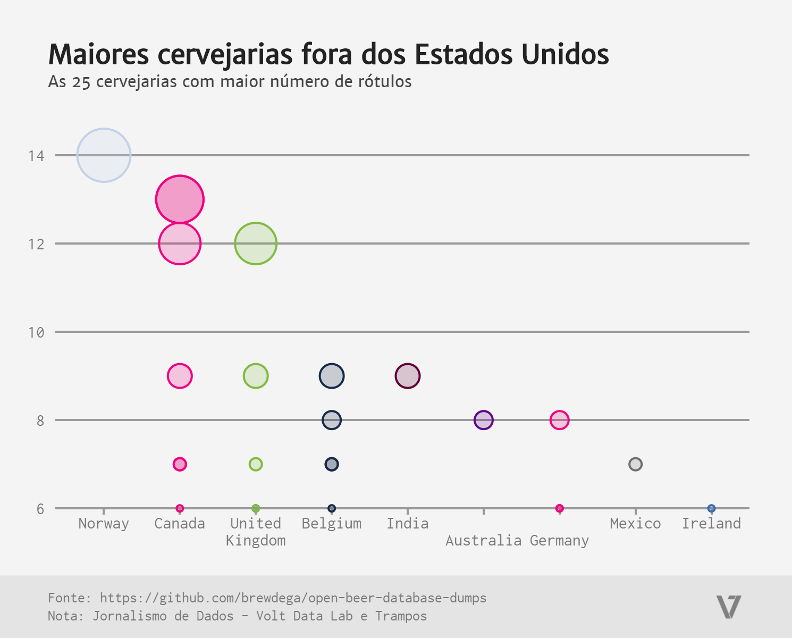

# Maiores cervejarias fora dos Estados Unidos

Noruega, Canadá e Reino Unido são os países que lideram o ranking das maiores cervejarias existentes fora dos Estados Unidos.

### [Fonte original](https://github.com/brewdega/open-beer-database-dumps )

Visualização criada durante o curso Jornalismo de Dados, ministrado por Sérgio Spagnuolo
